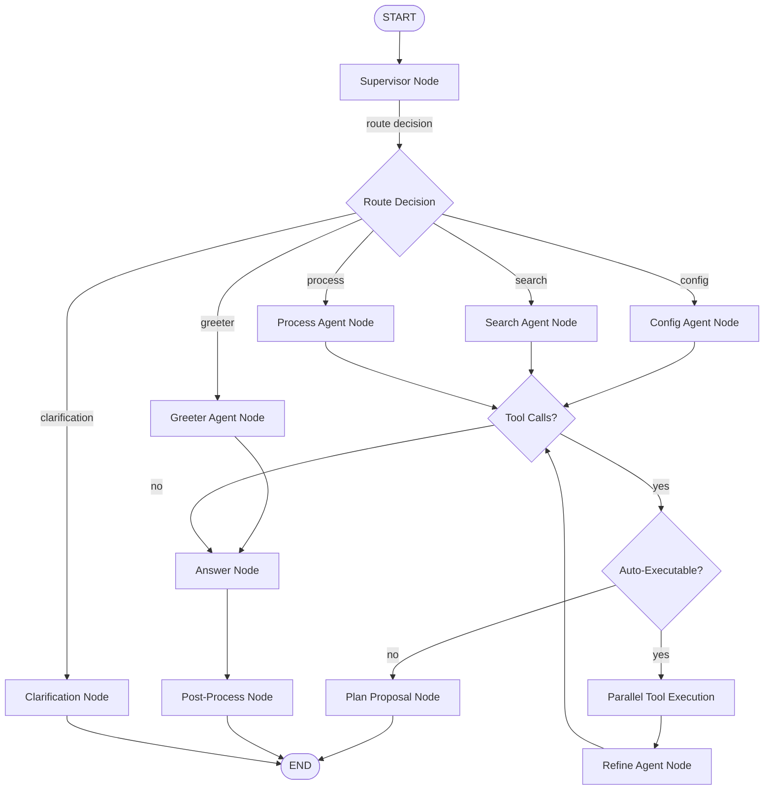

# LangGraph Architecture Plan for AI Agent System

## Executive Summary

This document provides a comprehensive plan to migrate the current AI agent system from a sequential LangChain-based architecture to a LangGraph-based graph architecture. The plan maintains 100% functional parity while introducing optimizations and leveraging LangGraph's advanced features like state management, conditional routing, parallelization, and persistence.

## Current Architecture Analysis

### Core Components

1. **AIAgent** (`agents/ai_agent.py`): Main orchestrator
   - Supervisor routing
   - Domain agent invocation
   - Tool execution with retry
   - Plan preparation and execution
   - Post-processing

2. **Supervisor Agent** (`agents/supervisor_agent.py`): Routes queries to domain agents
   - Uses `route_to_agent` tool
   - Supports clarification requests

3. **Domain Agents** (`agents/domain_agents.py`): Specialized agents
   - `config`: App/field/status/role management
   - `process`: Workflow design and optimization
   - `search`: Document search and Q&A
   - `greeter`: Greetings and meta questions

4. **Tool Executor** (`core/tool_executor.py`): Tool execution with retry logic
   - Tenant context management
   - Auto-executable tools (entry_search, document_search, get_permissions)
   - Retry with agent-based repair

5. **Session Manager** (`core/session_manager.py`): History and summarization
   - Rolling summary generation
   - Chat title generation
   - Context history building

6. **Response Parser** (`core/response_parser.py`): Extracts proposals/answers from LLM responses

7. **Tool Service** (`tools/tool_service.py`): Tool registry and execution

### Current Flow Patterns

1. **Routing Workflow**: Supervisor → Domain Agent
2. **Agent Workflow**: Domain Agent → Tool Calls → Postprocess
3. **Evaluator-Optimizer**: Retry logic with agent repair
4. **Parallelization**: Auto-execute search tools in parallel
5. **Orchestrator-Worker**: Supervisor delegates to domain agents

## LangGraph Architecture Design

### Graph Structure Overview



### State Schema

```python
from typing_extensions import TypedDict, Annotated
from typing import List, Dict, Any, Optional, Literal
from langgraph.graph import MessagesState
import operator

class AIAgentState(TypedDict):
    # User input
    query: str
    session_id: Optional[int]
    org_slug: Optional[str]
    user_id: Optional[int]
    org_roles: List[str]
    app_roles: List[str]
    
    # Supervisor routing
    supervisor_response: Optional[Any]
    routing_decision: Optional[Dict[str, Any]]  # {agent, query, require_clarification}
    
    # Agent execution
    current_agent: Optional[str]  # config, process, search, greeter
    agent_response: Optional[Any]
    tool_proposals: Annotated[List[Dict[str, Any]], operator.add]
    
    # Tool execution
    auto_executed_tools: Annotated[List[Dict[str, Any]], operator.add]
    pending_tools: Annotated[List[Dict[str, Any]], operator.add]
    tool_results: Annotated[List[Dict[str, Any]], operator.add]
    tool_errors: Annotated[List[str], operator.add]
    
    # History and context
    history: str
    summary_text: str
    context_snippets: List[str]
    retrieved_snippets: str
    
    # Output
    answer: Optional[str]
    plan_proposal: Optional[Dict[str, Any]]
    clarification: Optional[str]
    
    # Metadata
    token_usage: Dict[str, int]
    status: str  # planning, searching, preparing, complete
    status_message: str
```

### Node Implementations

#### 1. Supervisor Node

```python
def supervisor_node(state: AIAgentState) -> Dict[str, Any]:
    """
    Routes user query to appropriate domain agent.
    
    Uses supervisor agent to analyze query and make routing decision.
    """
    supervisor = build_supervisor(model_name)
    
    history = build_context_history(state)
    agentlog = "\n".join(state.get("agent_logs", []))
    
    response = supervisor.invoke({
        "query": state["query"],
        "history": history,
        "agentlog": agentlog,
    })
    
    routing = parse_supervisor_routing(response)
    
    return {
        "supervisor_response": response,
        "routing_decision": routing,
    }
```

#### 2. Route Decision Conditional Edge

```python
def route_decision(state: AIAgentState) -> Literal["clarification", "config", "search", "process", "greeter"]:
    """Route based on supervisor decision."""
    routing = state.get("routing_decision")
    if not routing:
        return "process"  # fallback
    
    if routing.get("require_clarification"):
        return "clarification"
    
    agent = routing.get("agent", "process")
    return agent  # type: ignore
```

#### 3. Domain Agent Nodes

```python
def config_agent_node(state: AIAgentState) -> Dict[str, Any]:
    """Execute config agent."""
    agent = build_config_agent(model_name, state["org_roles"], state["app_roles"])
    return _invoke_domain_agent(state, agent, "config")

def search_agent_node(state: AIAgentState) -> Dict[str, Any]:
    """Execute search agent."""
    agent = build_search_agent(model_name, state["org_roles"], state["app_roles"])
    return _invoke_domain_agent(state, agent, "search")

def process_agent_node(state: AIAgentState) -> Dict[str, Any]:
    """Execute process agent."""
    agent = build_process_agent(model_name, state["org_roles"], state["app_roles"])
    return _invoke_domain_agent(state, agent, "process")

def greeter_agent_node(state: AIAgentState) -> Dict[str, Any]:
    """Execute greeter agent."""
    agent = build_greeter_agent(model_name)
    return _invoke_domain_agent(state, agent, "greeter")

def _invoke_domain_agent(state: AIAgentState, agent: Runnable, agent_name: str) -> Dict[str, Any]:
    """Common logic for invoking domain agents."""
    routing = state.get("routing_decision", {})
    query = routing.get("query") or state["query"]
    
    history = build_context_history(state)
    context_snippets = "\n".join(f"- {s}" for s in state.get("context_snippets", []))
    
    # Build tool output context
    last_tool_output = ""
    last_tool_args = {}
    last_tool_error = ""
    
    if state.get("tool_results"):
        tool_executions = []
        for tr in state["tool_results"]:
            tool_executions.append({
                "tool": tr.get("tool"),
                "args": tr.get("args", {}),
                "output": tr.get("output"),
                "error": tr.get("error", ""),
            })
        last_tool_output = json.dumps(tool_executions, ensure_ascii=False)
        if tool_executions:
            last_tool_args = tool_executions[-1].get("args", {})
            last_tool_error = "; ".join(
                te.get("error") for te in tool_executions if te.get("error")
            )
    
    response = agent.invoke({
        "query": query,
        "history": history,
        "context_snippets": context_snippets,
        "retrieved_snippets": state.get("retrieved_snippets", ""),
        "last_tool_output": last_tool_output,
        "last_tool_args": json.dumps(last_tool_args),
        "last_tool_error": last_tool_error,
        "postprocess_mode": "",
    })
    
    # Extract proposals and answer
    proposals = extract_proposals(response)
    answer = extract_render_reply(response) or extract_answer(response)
    
    return {
        "current_agent": agent_name,
        "agent_response": response,
        "tool_proposals": [p.to_dict() for p in proposals],
        "answer": answer,
    }
```

#### 4. Tool Execution Nodes

```python
def auto_execute_tools_node(state: AIAgentState) -> Dict[str, Any]:
    """
    Auto-execute search tools and get_permissions in parallel.
    
    Uses LangGraph's Send API for parallel worker execution.
    """
    proposals = state.get("tool_proposals", [])
    auto_executable = [p for p in proposals if p["tool"] in AUTO_EXECUTE_TOOLS]
    
    if not auto_executable:
        return {}
    
    # Execute tools in parallel
    results = []
    errors = []
    
    for proposal in auto_executable:
        try:
            result = tool_executor.execute_simple(
                proposal["tool"],
                proposal["props"]
            )
            results.append({
                "tool": proposal["tool"],
                "args": proposal["props"],
                "output": result,
                "error": "",
            })
        except Exception as exc:
            errors.append(f"{proposal['tool']}: {str(exc)}")
            results.append({
                "tool": proposal["tool"],
                "args": proposal["props"],
                "output": None,
                "error": str(exc),
            })
    
    # Separate auto-executed from pending
    pending = [p for p in proposals if p["tool"] not in AUTO_EXECUTE_TOOLS]
    
    return {
        "auto_executed_tools": auto_executable,
        "tool_results": results,
        "tool_errors": errors,
        "pending_tools": pending,
    }

def execute_tool_node(state: AIAgentState) -> Dict[str, Any]:
    """
    Execute a single tool (for plan execution).
    
    Used when user approves a plan step.
    """
    # Get next pending tool
    pending = state.get("pending_tools", [])
    if not pending:
        return {}
    
    proposal = pending[0]
    
    try:
        result = tool_executor.execute(
            proposal["tool"],
            proposal["props"],
            agent_for_repairs=state.get("current_agent", "process"),
            query=state["query"],
        )
        
        return {
            "tool_results": [{
                "tool": proposal["tool"],
                "args": proposal["props"],
                "output": result,
                "error": "",
            }],
            "pending_tools": pending[1:],  # Remove executed tool
        }
    except ToolProposalNeeded as e:
        # Retry generated new proposals - convert to plan
        return {
            "plan_proposal": {
                "type": "plan_proposal",
                "plan": [{"action": "tool", "tool": p.tool, "props": p.props} for p in e.proposals],
            },
            "pending_tools": pending[1:],
        }
    except Exception as exc:
        return {
            "tool_results": [{
                "tool": proposal["tool"],
                "args": proposal["props"],
                "output": None,
                "error": str(exc),
            }],
            "tool_errors": [str(exc)],
            "pending_tools": pending[1:],
        }
```

#### 5. Refine Agent Node

```python
def refine_agent_node(state: AIAgentState) -> Dict[str, Any]:
    """
    Re-invoke agent with search results.
    
    Used after auto-executing search tools to let agent decide next steps.
    """
    agent_name = state.get("current_agent")
    if not agent_name:
        return {}
    
    agent = _route_to_agent(agent_name, state)
    
    # Build tool execution context
    tool_executions = state.get("tool_results", [])
    combined_output = json.dumps(tool_executions, ensure_ascii=False)
    combined_error = "; ".join(state.get("tool_errors", []))
    
    last_tool_args = {}
    if tool_executions:
        last_tool_args = tool_executions[-1].get("args", {})
    
    routing = state.get("routing_decision", {})
    query = routing.get("query") or state["query"]
    
    history = build_context_history(state, max_lines=8)
    context_snippets = "\n".join(f"- {s}" for s in state.get("context_snippets", []))
    
    response = agent.invoke({
        "query": query,
        "history": history,
        "context_snippets": context_snippets,
        "retrieved_snippets": "",
        "last_tool_output": combined_output,
        "last_tool_args": json.dumps(last_tool_args),
        "last_tool_error": combined_error,
        "postprocess_mode": "",
    })
    
    # Extract new proposals or answer
    proposals = extract_proposals(response)
    answer = extract_render_reply(response)
    
    return {
        "agent_response": response,
        "tool_proposals": [p.to_dict() for p in proposals],
        "answer": answer,
    }
```

#### 6. Post-Process Node

```python
def postprocess_node(state: AIAgentState) -> Dict[str, Any]:
    """
    Post-process tool output into user-friendly answer.
    
    Used after tool execution to format results.
    """
    agent_name = state.get("current_agent", "process")
    agent = _route_to_agent(agent_name, state)
    
    tool_results = state.get("tool_results", [])
    if not tool_results:
        return {"answer": state.get("answer")}
    
    # Build tool execution context
    tool_execution = tool_results[-1]  # Use last tool
    tool_output = json.dumps([tool_execution], ensure_ascii=False)
    tool_error = tool_execution.get("error", "")
    
    routing = state.get("routing_decision", {})
    query = routing.get("query") or state["query"]
    
    history = build_context_history(state, max_lines=8)
    context_snippets = "\n".join(f"- {s}" for s in state.get("context_snippets", []))
    
    response = agent.invoke({
        "query": f"[TOOL EXECUTED: {tool_execution['tool']}] {query}",
        "history": history,
        "context_snippets": context_snippets,
        "retrieved_snippets": "",
        "last_tool_output": tool_output,
        "last_tool_args": json.dumps(tool_execution.get("args", {})),
        "last_tool_error": tool_error,
        "postprocess_mode": "render_tool_output",
    })
    
    answer = extract_render_reply(response)
    
    return {"answer": answer}
```

#### 7. Plan Proposal Node

```python
def plan_proposal_node(state: AIAgentState) -> Dict[str, Any]:
    """
    Build plan proposal for user approval.
    
    Converts tool proposals into a structured plan.
    """
    proposals = state.get("pending_tools", [])
    if not proposals:
        return {}
    
    routing = state.get("routing_decision", {})
    agent = state.get("current_agent", "process")
    query = routing.get("query") or state["query"]
    
    plan_steps = []
    for proposal in proposals:
        plan_steps.append({
            "action": "tool",
            "tool": proposal["tool"],
            "props": proposal["props"],
            "agent": agent,
            "query": query,
        })
    
    return {
        "plan_proposal": {
            "type": "plan_proposal",
            "plan": plan_steps,
            "plan_index": 0,
            "plan_total": len(plan_steps),
        },
    }
```

#### 8. Answer Node

```python
def answer_node(state: AIAgentState) -> Dict[str, Any]:
    """
    Finalize answer for user.
    
    Combines answers from multiple sources if needed.
    """
    answer = state.get("answer")
    if answer:
        return {"answer": answer}
    
    # Fallback: extract from agent response
    agent_response = state.get("agent_response")
    if agent_response:
        answer = extract_answer(agent_response)
        return {"answer": answer or ""}
    
    return {"answer": ""}
```

#### 9. Clarification Node

```python
def clarification_node(state: AIAgentState) -> Dict[str, Any]:
    """Return clarification question to user."""
    routing = state.get("routing_decision", {})
    clarification = routing.get("query", "")
    
    return {"clarification": clarification}
```

### Conditional Edges

```python
def should_auto_execute(state: AIAgentState) -> Literal["auto_execute", "plan_proposal", "answer"]:
    """Decide whether to auto-execute tools or create plan."""
    proposals = state.get("tool_proposals", [])
    
    if not proposals:
        return "answer"
    
    auto_executable = [p for p in proposals if p["tool"] in AUTO_EXECUTE_TOOLS]
    pending = [p for p in proposals if p["tool"] not in AUTO_EXECUTE_TOOLS]
    
    if auto_executable and state.get("current_agent") in ("config", "search"):
        return "auto_execute"
    elif pending:
        return "plan_proposal"
    else:
        return "answer"

def should_refine(state: AIAgentState) -> Literal["refine", "postprocess", "answer"]:
    """Decide whether to refine with search results or postprocess."""
    auto_executed = state.get("auto_executed_tools", [])
    
    if auto_executed and state.get("current_agent") in ("config", "search"):
        return "refine"
    
    tool_results = state.get("tool_results", [])
    if tool_results:
        return "postprocess"
    
    return "answer"

def has_more_tools(state: AIAgentState) -> Literal["execute_tool", "postprocess"]:
    """Check if more tools need execution."""
    pending = state.get("pending_tools", [])
    return "execute_tool" if pending else "postprocess"
```

### Graph Construction

```python
from langgraph.graph import StateGraph, START, END

def build_ai_agent_graph() -> StateGraph:
    """Build the complete AI agent graph."""
    
    workflow = StateGraph(AIAgentState)
    
    # Add nodes
    workflow.add_node("supervisor", supervisor_node)
    workflow.add_node("config_agent", config_agent_node)
    workflow.add_node("search_agent", search_agent_node)
    workflow.add_node("process_agent", process_agent_node)
    workflow.add_node("greeter_agent", greeter_agent_node)
    workflow.add_node("clarification", clarification_node)
    workflow.add_node("auto_execute_tools", auto_execute_tools_node)
    workflow.add_node("refine_agent", refine_agent_node)
    workflow.add_node("execute_tool", execute_tool_node)
    workflow.add_node("postprocess", postprocess_node)
    workflow.add_node("plan_proposal", plan_proposal_node)
    workflow.add_node("answer", answer_node)
    
    # Add edges
    workflow.add_edge(START, "supervisor")
    
    # Supervisor routing
    workflow.add_conditional_edges(
        "supervisor",
        route_decision,
        {
            "clarification": "clarification",
            "config": "config_agent",
            "search": "search_agent",
            "process": "process_agent",
            "greeter": "greeter_agent",
        }
    )
    
    # Domain agent routing
    for agent_name in ["config_agent", "search_agent", "process_agent"]:
        workflow.add_conditional_edges(
            agent_name,
            should_auto_execute,
            {
                "auto_execute": "auto_execute_tools",
                "plan_proposal": "plan_proposal",
                "answer": "answer",
            }
        )
    
    # Greeter always goes to answer
    workflow.add_edge("greeter_agent", "answer")
    
    # Auto-execute routing
    workflow.add_conditional_edges(
        "auto_execute_tools",
        should_refine,
        {
            "refine": "refine_agent",
            "postprocess": "postprocess",
            "answer": "answer",
        }
    )
    
    # Refine routing (back to tool check)
    workflow.add_conditional_edges(
        "refine_agent",
        should_auto_execute,
        {
            "auto_execute": "auto_execute_tools",
            "plan_proposal": "plan_proposal",
            "answer": "answer",
        }
    )
    
    # Tool execution routing
    workflow.add_conditional_edges(
        "execute_tool",
        has_more_tools,
        {
            "execute_tool": "execute_tool",
            "postprocess": "postprocess",
        }
    )
    
    # Postprocess to answer
    workflow.add_edge("postprocess", "answer")
    
    # Plan proposal and clarification to end
    workflow.add_edge("plan_proposal", END)
    workflow.add_edge("clarification", END)
    workflow.add_edge("answer", END)
    
    return workflow.compile()
```

## Optimization Opportunities

### 1. Parallel Tool Execution

**Current**: Tools executed sequentially even when independent.

**Optimization**: Use LangGraph's `Send` API to execute independent tools in parallel.

```python
from langgraph.types import Send

def parallel_tool_workers_node(state: AIAgentState):
    """Execute multiple tools in parallel using Send API."""
    proposals = state.get("tool_proposals", [])
    auto_executable = [p for p in proposals if p["tool"] in AUTO_EXECUTE_TOOLS]
    
    # Create worker nodes dynamically
    return [Send("tool_worker", {"proposal": p}) for p in auto_executable]

def tool_worker_node(state: Dict[str, Any]) -> Dict[str, Any]:
    """Worker node for individual tool execution."""
    proposal = state["proposal"]
    try:
        result = tool_executor.execute_simple(proposal["tool"], proposal["props"])
        return {"output": result, "error": ""}
    except Exception as exc:
        return {"output": None, "error": str(exc)}
```

### 2. State Persistence

**Current**: State managed manually in Django models.

**Optimization**: Use LangGraph's built-in persistence for checkpointing.

```python
from langgraph.checkpoint.postgres import PostgresSaver

checkpointer = PostgresSaver.from_conn_string(connection_string)

workflow = build_ai_agent_graph()
workflow = workflow.compile(checkpointer=checkpointer)

# Resume from checkpoint
config = {"configurable": {"thread_id": f"session_{session_id}"}}
result = workflow.invoke(initial_state, config=config)
```

### 3. Streaming Updates

**Current**: Status updates via cache polling.

**Optimization**: Use LangGraph streaming for real-time updates.

```python
for event in workflow.stream(initial_state, config=config, stream_mode="updates"):
    # Send updates to frontend via WebSocket
    send_update(event)
```

### 4. Error Recovery

**Current**: Retry logic embedded in ToolExecutor.

**Optimization**: Use LangGraph's interrupt/human-in-the-loop for error recovery.

```python
from langgraph.graph import interrupt

def execute_tool_with_interrupt(state: AIAgentState):
    """Execute tool with interrupt on error."""
    try:
        result = tool_executor.execute(...)
        return {"tool_results": [result]}
    except Exception as exc:
        # Interrupt for human review
        interrupt({"error": str(exc), "proposal": state["pending_tools"][0]})
        return {}
```

### 5. History Summarization

**Current**: Summarization triggered manually.

**Optimization**: Use conditional edge to trigger summarization when history exceeds threshold.

```python
def should_summarize(state: AIAgentState) -> Literal["summarize", "continue"]:
    """Check if history needs summarization."""
    history_chars = len(state.get("history", ""))
    if history_chars > SUMMARY_HISTORY_CHAR_LIMIT:
        return "summarize"
    return "continue"

def summarize_node(state: AIAgentState) -> Dict[str, Any]:
    """Generate summary of conversation history."""
    summary = session_manager.summarize_history(reason="graph_checkpoint")
    return {"summary_text": summary}
```

## Migration Strategy

### Phase 1: Core Graph Structure
1. Implement state schema
2. Build supervisor and routing nodes
3. Implement domain agent nodes
4. Add basic conditional edges

### Phase 2: Tool Execution
1. Implement auto-execute tools node
2. Add refine agent node
3. Implement postprocess node
4. Add plan proposal node

### Phase 3: Advanced Features
1. Add parallel tool execution
2. Implement state persistence
3. Add streaming support
4. Implement error recovery

### Phase 4: Optimization
1. Add history summarization node
2. Optimize context building
3. Add caching layer
4. Performance tuning

## Testing Strategy

### External Test Project Structure

```
test_project/
├── prompts/
│   ├── supervisor.md          # Copy from backend/ai_new/prompts/
│   ├── config.md
│   ├── search.md
│   ├── process_optimization.md
│   └── greeter.md
├── tools/
│   ├── tool_definitions.py     # Extract tool schemas
│   └── tool_mocks.py          # Mock implementations
├── graph/
│   ├── state.py               # State schema
│   ├── nodes.py               # All node implementations
│   ├── edges.py               # Conditional edge functions
│   └── graph.py               # Graph construction
├── utils/
│   ├── session_manager.py     # Simplified session manager
│   ├── response_parser.py     # Copy from core/
│   └── tool_executor.py       # Simplified tool executor
└── test_main.py               # Test entry point
```

### Tool Extraction

Extract tool definitions from `backend/ai_new/tools/`:

1. **Tool Schemas**: Extract Pydantic models and function signatures
2. **Tool Descriptions**: Extract docstrings and descriptions
3. **Tool Categories**: Group by domain (config, search, process)

### Prompt Extraction

Copy all prompts from `backend/ai_new/prompts/`:
- `supervisor.md`
- `config.md`
- `search.md`
- `process_optimization.md`
- `greeter.md`
- `summarizer.md`

## Key Design Decisions

### 1. State Management
- Use TypedDict for type safety
- Use Annotated with operator.add for list accumulation
- Separate read/write concerns

### 2. Node Granularity
- One node per logical operation
- Keep nodes focused and testable
- Use conditional edges for routing

### 3. Error Handling
- Use ToolProposalNeeded exception for retry proposals
- Interrupt on critical errors
- Graceful degradation

### 4. Tool Execution
- Auto-execute search tools for speed
- Require approval for destructive operations
- Parallel execution where possible

### 5. Context Management
- Build history on-demand
- Cache context snippets
- Summarize proactively

## Performance Considerations

### Token Usage
- Track tokens per node
- Optimize prompt sizes
- Use summarization aggressively

### Latency
- Parallel tool execution
- Stream intermediate results
- Cache frequent queries

### Scalability
- Stateless nodes where possible
- Use checkpoints for long-running flows
- Batch operations

## Security Considerations

### Tenant Isolation
- Always pass org_slug in state
- Validate tenant context in nodes
- Isolate tool execution

### Role-Based Access
- Filter tools by roles
- Validate permissions in nodes
- Audit tool executions

### Input Validation
- Validate state schema
- Sanitize user input
- Rate limit requests

## Monitoring and Observability

### Metrics
- Node execution times
- Token usage per node
- Error rates
- Tool execution success rates

### Logging
- Log state transitions
- Log tool executions
- Log errors with context

### Tracing
- Trace request through graph
- Track state changes
- Monitor checkpoint usage

## Future Enhancements

### 1. Multi-Agent Collaboration
- Allow agents to collaborate
- Share context between agents
- Parallel agent execution

### 2. Learning and Adaptation
- Learn from user feedback
- Adapt routing decisions
- Optimize tool selection

### 3. Advanced Caching
- Cache agent responses
- Cache tool results
- Cache context snippets

### 4. Workflow Templates
- Pre-defined workflows
- Customizable templates
- Workflow versioning

## Conclusion

This architecture plan provides a comprehensive roadmap for migrating to LangGraph while maintaining 100% functional parity. The graph-based approach offers better observability, parallelization, and state management compared to the current sequential architecture.

Key benefits:
- **Better State Management**: Centralized state with type safety
- **Parallel Execution**: Tools and agents can run in parallel
- **Observability**: Clear graph visualization and tracing
- **Persistence**: Built-in checkpointing and recovery
- **Streaming**: Real-time updates to frontend
- **Error Recovery**: Interrupt and human-in-the-loop support

The external test project will validate the architecture before full migration, ensuring all capabilities are preserved and optimized.
