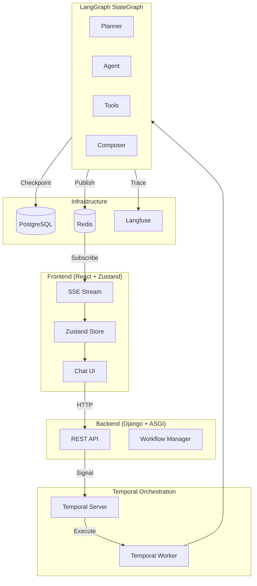
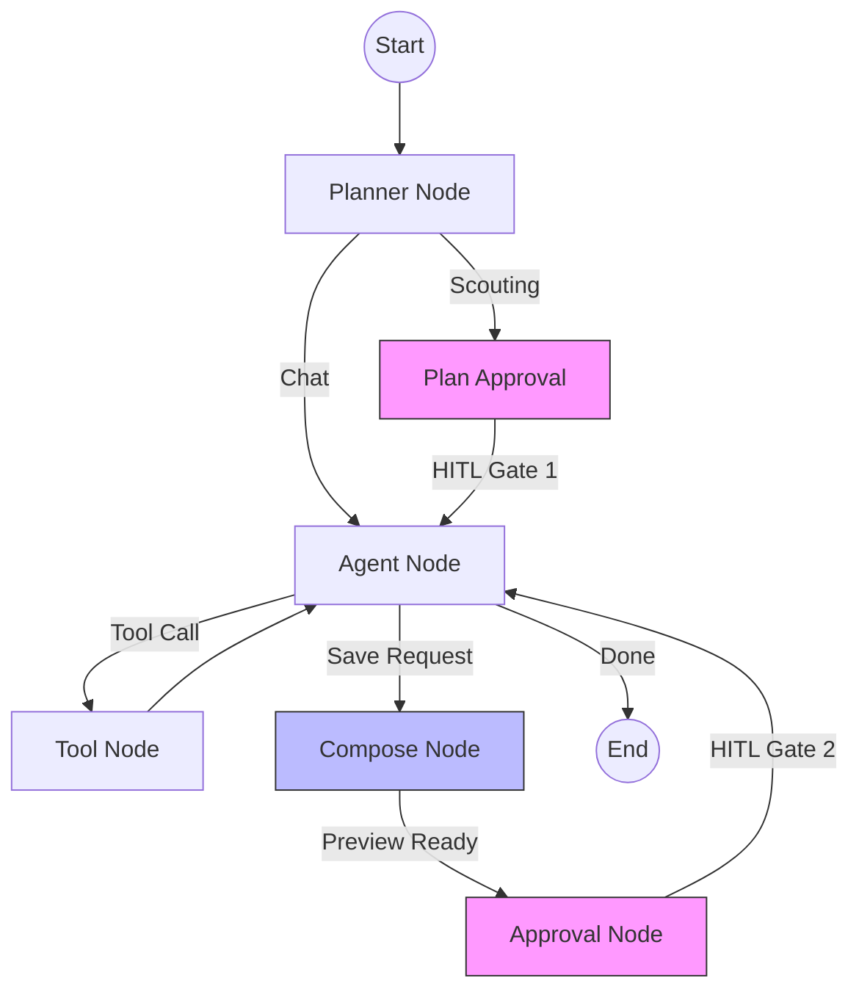
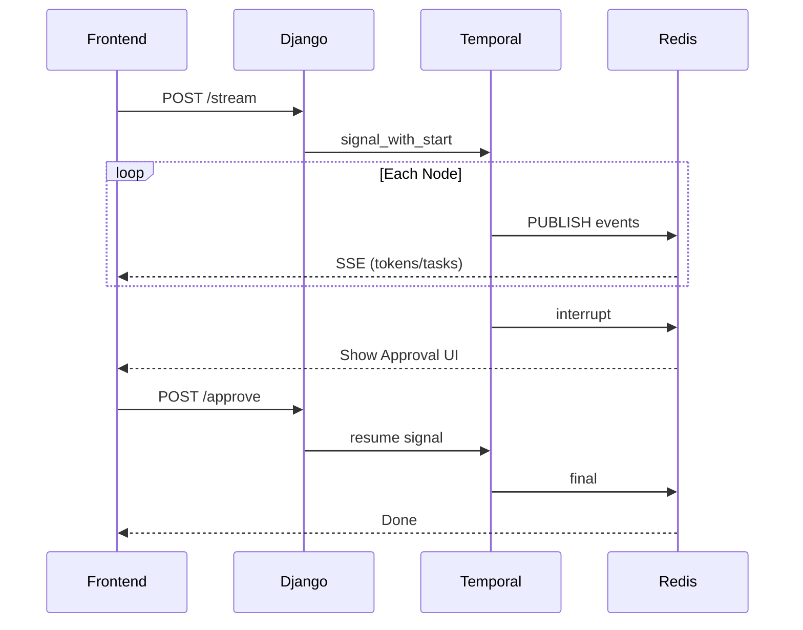

# Sports Scouting Agent

A production-grade agentic web application for sports player scouting. The agent accepts natural language goals, generates execution plans, and performs real actions across server and client.


**[Watch Full Demo on YouTube]([https://youtu.be/JvumbHCRn7E])**

---

## Quick Start


### 1. Environment Setup

```bash
cp .env.example .env
```

### 2. Launch Services
```bash
docker-compose build backend
```

```bash
docker-compose up -d
```

Wait for all services to be healthy (~60 seconds on first run).

### 3. Configure Observability (Required)

Navigate to **http://localhost:3001** (Langfuse) and:

1. **Register** an account
2. **Create Organization** → Create **Project**
3. Go to **Settings** → **API Keys** → Generate **Public Key** and **Secret Key**

### 4. Application Setup

1. Open **http://localhost:3000**
2. Register/Login
3. Go to **Profile Settings**
4. Enter your:
   - OpenAI API Key
   - Langfuse Public Key
   - Langfuse Secret Key
5. Press **Save**

You're ready to scout players.

---

## What This App Does


A scouting agent that demonstrates:

| Requirement | Implementation |
|-------------|----------------|
| **Agent Behavior** | Accepts freeform goals → Generates search plan → Executes steps autonomously |
| **Activity Log** | Real-time task panel showing plan steps, tool executions, success/failure states |
| **Server Actions (3+)** | `search_documents` (RAG), `save_player_report` (DB persist), plan generation (LLM workflow) |
| **Client Actions (2+)** | Dynamic plan panel rendering, player preview card with approval UI |
| **Knowledge System** | RAG with pgvector embeddings, session history, accumulated search context |
| **User Approval** | Two HITL gates: Plan approval + Save approval (no silent destructive actions) |
| **Frontend Quality** | Conversation view, plan panel, trace log, saved reports page |

---

## Server-Side Tools

| Tool | Description | Real Work |
|------|-------------|-----------|
| `search_documents` | RAG retrieval via pgvector | Embedding search, returns ranked chunks |
| `save_player_report` | Persists scouting report | Creates Player + ScoutingReport records |
| `list_reports` | Query existing reports | DB lookup with filtering, prevents duplicates |
| `plan_generation` | LLM-powered planning | Analyzes request, generates 3-5 search steps |

---

## Client-Side Actions

| Action | Trigger | Observable Behavior |
|--------|---------|---------------------|
| Plan Panel Update | `plan_proposal` event | Right sidebar populates with search steps + approve button |
| Player Preview Card | `player_preview` event | Modal shows extracted player data with approve/reject |
| Task Progress | `tasks_updated` event | Real-time checkmarks on completed steps |
| Token Streaming | `token` events | Character-by-character response rendering |

---

## Knowledge System

**Where it lives:**
- PostgreSQL with pgvector extension
- Document chunks with embeddings
- Player scouting reports (persisted via `save_player_report`)

**How it's used:**
- Agent searches knowledge base via `search_documents` tool
- RAG context accumulates across plan steps
- UI shows "Searching knowledge base..." during retrieval
- Report composition uses all gathered context
- Saved player reports become part of the searchable knowledge base

---

## Architecture

### System Overview



### Agent Workflow (StateGraph)



### Real-Time Streaming



See [docs/ARCHITECTURE.md](./docs/ARCHITECTURE.md) for more diagrams.

**Core Stack:**
- **Frontend:** React 18 + Zustand + SSE streaming
- **Backend:** Django 5 + ASGI + REST
- **Orchestration:** Temporal (durable workflows, signal-based)
- **Agent Graph:** LangGraph StateGraph (6-node workflow)
- **Real-time:** Redis Pub/Sub with backpressure
- **Observability:** Langfuse v3 (per-user tracing)
- **Storage:** PostgreSQL + pgvector

**Key Design Decisions:**
- Temporal ensures workflow durability across failures
- Redis pub/sub enables real-time token streaming
- Two-gate HITL prevents unintended data persistence
- Per-user Langfuse isolation for multi-tenant tracing

---

## Security Considerations

- **API Key Isolation:** Per-user OpenAI/Langfuse credentials
- **Data Isolation:** All records filtered by `user_id`/`owner`
- **No Silent Actions:** Destructive operations require explicit approval
- **Input Validation:** Pydantic schemas on all API endpoints
- **Rate Limiting:** Concurrent stream limits per user

See [docs/security_check.md](./docs/security_check.md) for security audit notes.

---

## Tradeoffs

| Decision | Tradeoff |
|----------|----------|
| LangChain + LangGraph over CrewAI | More control over state and flow, but requires manual orchestration |
| Temporal over simple queues | Added complexity, but gained durability + visibility |
| Redis pub/sub over WebSocket | Extremely fast message delivery with simpler scaling |
| In-memory message buffer | Fast streaming, requires bulk persist on close |
| PostgreSQL over NoSQL | ACID compliance and pgvector support, relational constraints |
| Graph API over functional API | Declarative node definitions, cleaner state transitions |

---

## Future Improvements

- **Dynamic Sub-Agent Creation:** Spawn specialized agents (stats analyst, injury scout, transfer market) based on query type for faster, more robust scouting
- **More Agent Capabilities:** Player comparison mode, side-by-side analysis
- **New Tools:** Web search integration for real-time data gathering
- **More API Provider Support:** Additional LLM providers, local model support
- **Enhanced Reranking:** Expanded reranker integration (currently optional via Cohere)
- **Real-Time Player API:** Live data pipeline connection for up-to-date player statistics

---

## Project Structure

```
.
├── backend/
│   └── app/
│       ├── agents/          # LangGraph + Temporal workflows
│       │   ├── graph/       # StateGraph nodes, state, tools
│       │   └── temporal/    # Workflow definitions
│       ├── api/             # REST endpoints
│       ├── db/              # Django models
│       ├── rag/             # Retrieval pipeline
│       └── observability/   # Langfuse integration
├── frontend/
│   └── src/
│       ├── app/             # Pages
│       ├── components/      # UI components
│       ├── state/           # Zustand stores
│       └── lib/             # SSE streaming
├── docs/                    # Architecture diagrams
└── docker-compose.yml
```

---

## Services

| Service | Port | Purpose |
|---------|------|---------|
| Frontend | 3000 | React application |
| Backend | 8000 | Django API |
| Langfuse | 3001 | Observability UI |
| Temporal UI | 8080 | Workflow monitoring |
| PostgreSQL | 5432 | Primary database |
| Redis | 6379 | Pub/sub messaging |

---

## Stress Test Results

Concurrent user load testing with Temporal worker scaling:

| Level | Users | Success | Throughput | Median Latency |
|-------|-------|---------|------------|----------------|
| 1 | 10 | 100% | 2.3/s | 3.5s |
| 2 | 20 | 100% | 6.4/s | 2.5s |
| 3 | 50 | 100% | 6.5/s | 6.5s |
| 4 | 100 | 100% | 6.2/s | 13.2s |
| 5 | 200 | 67.5%* | 3.3/s | 41.2s |

*Level 5 with 2 workers; scale to 4 workers for 200+ users.

**Scaling:** The system scales horizontally by adding Temporal workers. Each worker processes LangGraph workflows independently, and Temporal distributes work automatically.

```bash
# Scale workers for higher load
docker-compose up -d --scale worker=4
```

See [docs/STRESS_TEST.md](./docs/STRESS_TEST.md) for full documentation.

---

## License

MIT
