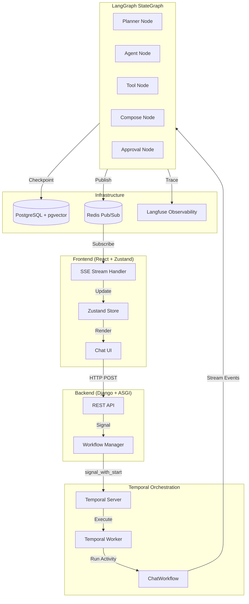
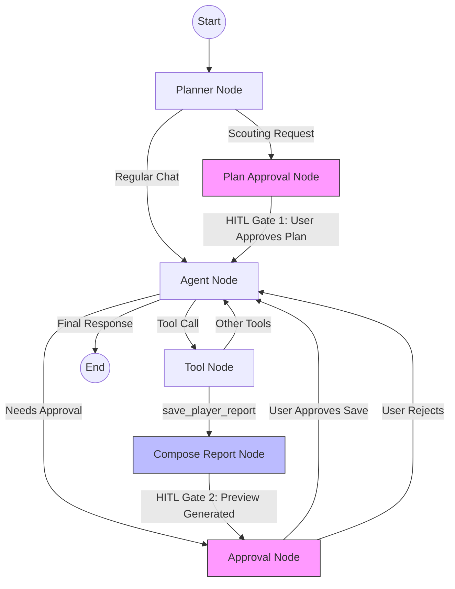
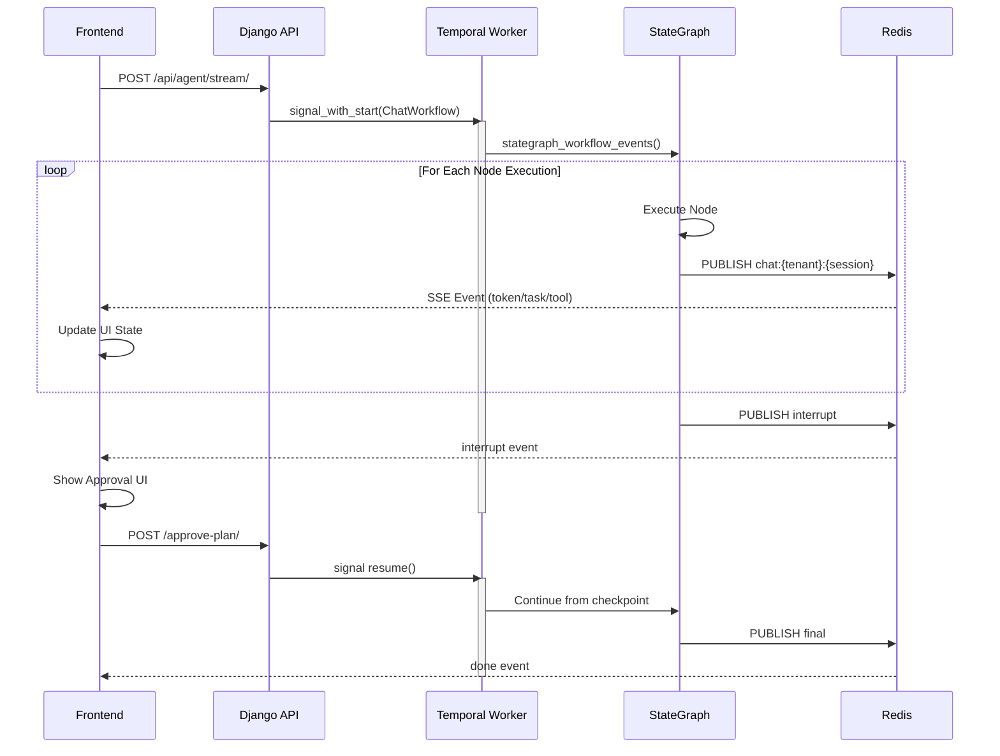
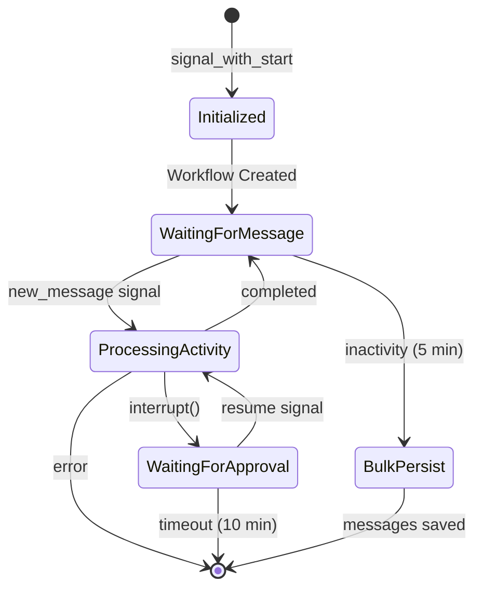
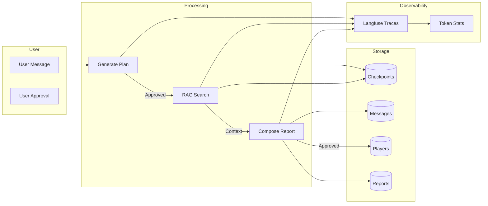

# Architecture Diagrams

## System Overview

```mermaid
flowchart TB
    subgraph Client["Frontend (React + Zustand)"]
        UI[Chat UI]
        SSE[SSE Stream Handler]
        State[Zustand Store]
    end

    subgraph Backend["Backend (Django + ASGI)"]
        API[REST API]
        WM[Workflow Manager]
    end

    subgraph Temporal["Temporal Orchestration"]
        TS[Temporal Server]
        TW[Temporal Worker]
        CW[ChatWorkflow]
    end

    subgraph StateGraph["LangGraph StateGraph"]
        PN[Planner Node]
        AN[Agent Node]
        TN[Tool Node]
        CN[Compose Node]
        ApN[Approval Node]
    end

    subgraph Infrastructure
        PG[(PostgreSQL + pgvector)]
        RD[(Redis Pub/Sub)]
        LF[Langfuse Observability]
    end

    UI -->|HTTP POST| API
    API -->|Signal| WM
    WM -->|signal_with_start| TS
    TS -->|Execute| TW
    TW -->|Run Activity| CW
    CW -->|Stream Events| StateGraph
    StateGraph -->|Publish| RD
    RD -->|Subscribe| SSE
    SSE -->|Update| State
    State -->|Render| UI
    StateGraph -->|Checkpoint| PG
    StateGraph -->|Trace| LF
```

## Agent Workflow (StateGraph)

```mermaid
flowchart TD
    START((Start)) --> PN[Planner Node]

    PN -->|Scouting Request| PA[Plan Approval Node]
    PN -->|Regular Chat| AN[Agent Node]

    PA -->|"HITL Gate 1: User Approves Plan"| AN

    AN -->|Tool Call| TN[Tool Node]
    AN -->|Needs Approval| ApN[Approval Node]
    AN -->|Final Response| END((End))

    TN -->|save_player_report| CN[Compose Report Node]
    TN -->|Other Tools| AN

    CN -->|"HITL Gate 2: Preview Generated"| ApN

    ApN -->|"User Approves Save"| AN
    ApN -->|"User Rejects"| AN

    style PA fill:#f9f,stroke:#333
    style ApN fill:#f9f,stroke:#333
    style CN fill:#bbf,stroke:#333
```

## Redis Real-Time Streaming

```mermaid
sequenceDiagram
    participant FE as Frontend
    participant API as Django API
    participant TW as Temporal Worker
    participant SG as StateGraph
    participant RD as Redis

    FE->>API: POST /api/agent/stream/
    API->>TW: signal_with_start(ChatWorkflow)

    activate TW
    TW->>SG: stategraph_workflow_events()

    loop For Each Node Execution
        SG->>SG: Execute Node
        SG->>RD: PUBLISH chat:{tenant}:{session}
        RD-->>FE: SSE Event (token/task/tool)
        FE->>FE: Update UI State
    end

    SG->>RD: PUBLISH interrupt
    RD-->>FE: interrupt event
    FE->>FE: Show Approval UI
    deactivate TW

    FE->>API: POST /approve-plan/
    API->>TW: signal resume()

    activate TW
    TW->>SG: Continue from checkpoint
    SG->>RD: PUBLISH final
    RD-->>FE: done event
    deactivate TW
```

## Temporal Workflow Lifecycle

```mermaid
stateDiagram-v2
    [*] --> Initialized: signal_with_start

    Initialized --> WaitingForMessage: Workflow Created

    WaitingForMessage --> ProcessingActivity: new_message signal

    ProcessingActivity --> WaitingForApproval: interrupt()
    ProcessingActivity --> WaitingForMessage: completed
    ProcessingActivity --> [*]: error

    WaitingForApproval --> ProcessingActivity: resume signal
    WaitingForApproval --> [*]: timeout (10 min)

    WaitingForMessage --> BulkPersist: inactivity (5 min)
    BulkPersist --> [*]: messages saved
```

## Data Flow Architecture

```mermaid
flowchart LR
    subgraph User
        Input[User Message]
        Approval[User Approval]
    end

    subgraph Processing
        Plan[Generate Plan]
        Search[RAG Search]
        Compose[Compose Report]
    end

    subgraph Storage
        CP[(Checkpoints)]
        MSG[(Messages)]
        PLR[(Players)]
        RPT[(Reports)]
    end

    subgraph Observability
        Trace[Langfuse Traces]
        Stats[Token Stats]
    end

    Input --> Plan
    Plan -->|Approved| Search
    Search -->|Context| Compose
    Compose -->|Approved| PLR
    Compose --> RPT

    Plan --> CP
    Search --> CP
    Compose --> MSG

    Plan --> Trace
    Search --> Trace
    Compose --> Trace
    Trace --> Stats
```
